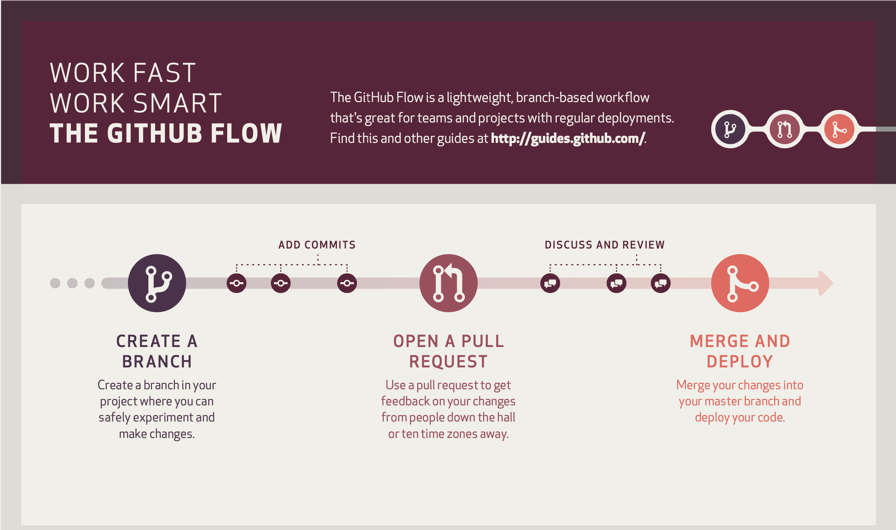

# Del 3: Vanliga situationer

> Del 3 av 3 i guiden [Arbeta med GitHub Desktop](working-with-github-desktop.md)

Parallellt till detta dokument finns också [Tips och Tricks](tips-and-tricks.md)

* [Merge Conflicts](#merge-conflicts)
* [GitHub Flow](#github-flow)

## Merge conflicts

En sk. *merge conflict* uppstår när två personer arbetar på samma ställe i en
fil och sedan vill göra en *merge* till en gemensam *branch*, t.ex. `main`. Det
lättaste sättet att undvika detta är att ha tydlig kommunikation på förhand om
vem som ska göra vad, så ni inte arbetar på samma saker.

När Git upptäcker en konflikt skapar den en markering i den berörda filen. Det
är sedan upp till er att manuellt välja vad ni vill behålla. Ha i åtanke att en
konflikt alltid handlar om att två personer redigerat på samma ställe - så ni
får välja att behålla båda ändringarna, den enas, eller inget alls.

En konfliktmarkering sker inom en *merge* av två *branches* och ser ut på
följande vis:

```
<<<<<<< HEAD

Här är den nuvarande bit kod som är på plats

=======

Och här är den inkommande bit kod, som ger oss en konflikt

>>>>>>> sebbes-test-branch
```

Git stoppar alltså in ovanstående extra textrader i er fil. Vi har `=======` som
separerar dom två olika ändringarna. Den nuvarande ändringen markeras i ovankant
med`<<<<<<< Nuvarande branch` och den inkommande ändringen (som skapade en
konflikt) markeras med `>>>>>>> Inkommande branch` i underkant.

Det kräver lite manuell handpåläggning i era filer för att lösa dessa
konflikter. Däremot har dom flesta moderna textredigerare inbyggt stöd som
hjälper er att göra detta genom några få knapptryck istället.

[Skärminspelning: merge conflict](assets/V07-merge-conflict.mp4)

## GitHub Flow

I del 2 beskrev vi en arbetsprocess som bestod av att skapa en *branch*, göra
sina *commits* och sedan göra en *merge* till `main`. Detta är en variant på en
arbetsprocess och ett företag kan ha sin egen för hur dom versionshanterar.

En populär metod idag är en som kallas för *GitHub Flow* och är mer eller mindre
densamma som vi gick igenom, men istället för att göra en *merge* direkt till
`main` så görs en sk. *Pull Request* först. En *Pull Request* ett förslag till
en *merge* men ger möjlighet för andra att se vad din *merge*, och dina
*commits*, innehåller. Allt detta sker via GitHub och det ser ungefär ut som att
ni öppnar en forumtråd där andra kan diskutera ditt förslag till ändringar.

Denna metod (GitHub Flow) används väldigt mycket inom Open Source projekt på
GitHub och därför väljer vi att presentera den här också.

GitHub Desktop gör denna process väldigt enkelt. När ni arbetar på en *branch*
och sedan har publicerat den och gjort några *commits* så ser ni att den fina
blåa knappen innehåller "Create Pull Request". Den tar er direkt till GitHub och
sedan kan ni fylla i lite mer beskrivning om ert förslag till ändringar.
Därefter kan alla andra i projektet läsa mer om detta förslag på
`https://github.com/ANVÄNDARNAMN/REPOSITORY/pulls`. Den som skapade repositoryt
kan sedan välja att gå vidare med att *merga* förslaget till, t.ex., `main`.

Läs mer om [GitHub Flow här](https://docs.github.com/en/get-started/quickstart/github-flow).


