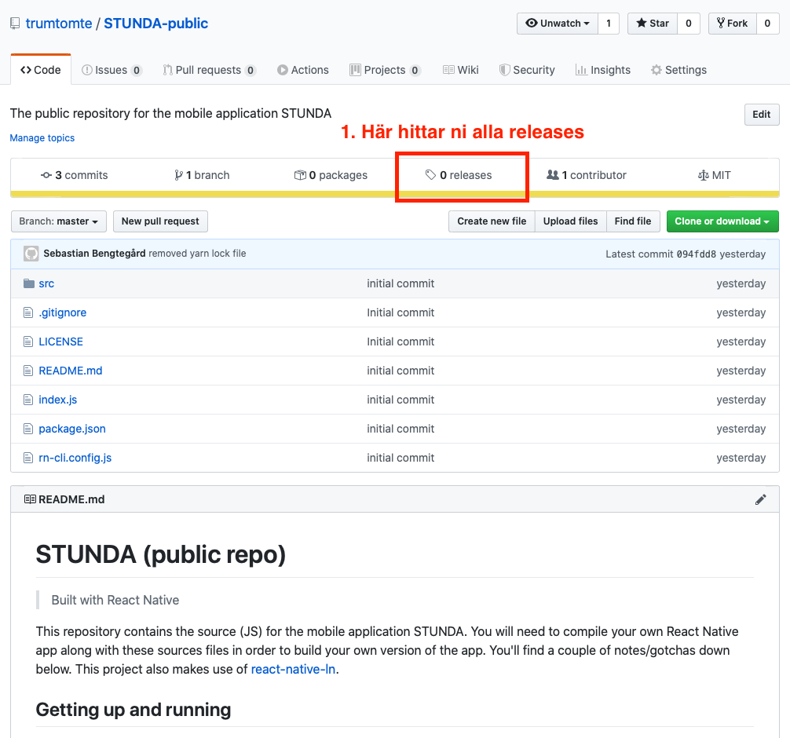
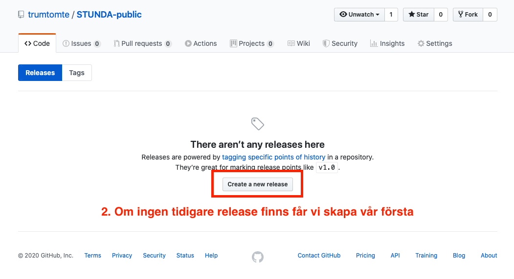
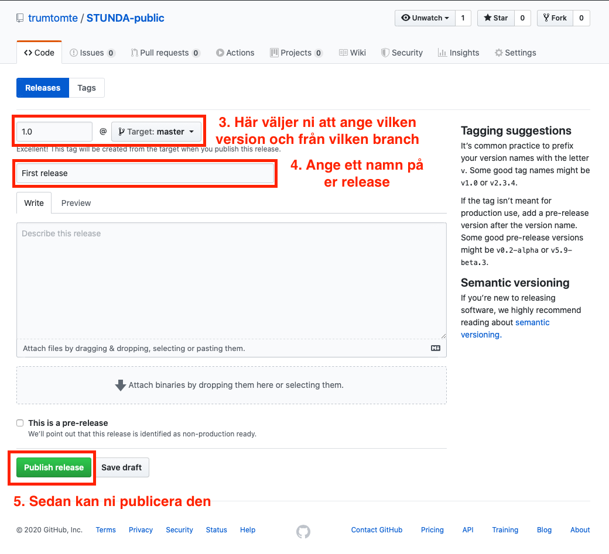
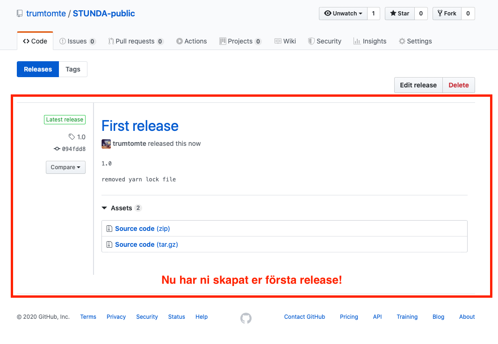

# Git Tag via GitHub.com

En så kallad Git Tag är ett sätt att skapa en release av din kod, till exempel `v1.0.0` eller `v2.0.4` och så vidare. Detta kan antingen göras genom en terminal med hjälp av kommandot `git tag` men även genom github.com's gränssnitt.

Nedan hittar ni en serie bilder som beskriver denna korta process.

